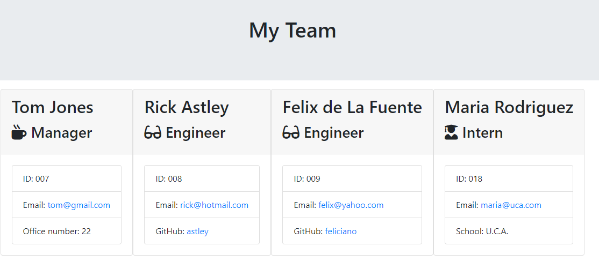

# Team Profile Generator

## Description
A Node.js command-line application. This application will take in information about employees on a software engineering team, then generates an HTML webpage that displays summaries for each person.

## Table of content
- [Installation](#installation)
- [Usage](#usage)
- [Tests](#tests)
- [License](#license)
- [Questions](#questions)
## Installation
Download the repository to a local folder. Please note that Node.js is required. Install all dependencies running in terminal the command nmp i. Run the program typing node index.js

## Usage
Add the information for each user when prompted in the terminal. The result file will be in the output file.
Screenshot of the rendered html:

## Tests
Tested using jest. Tests:17 passed, 17 total

## License
GLP

## Questions
e-mail: [jose.m.alonso.g@gmail.com](mailto:jose.m.alonso.g@gmail.com)
GitHub: [turquele](https://github.com/turquele)
